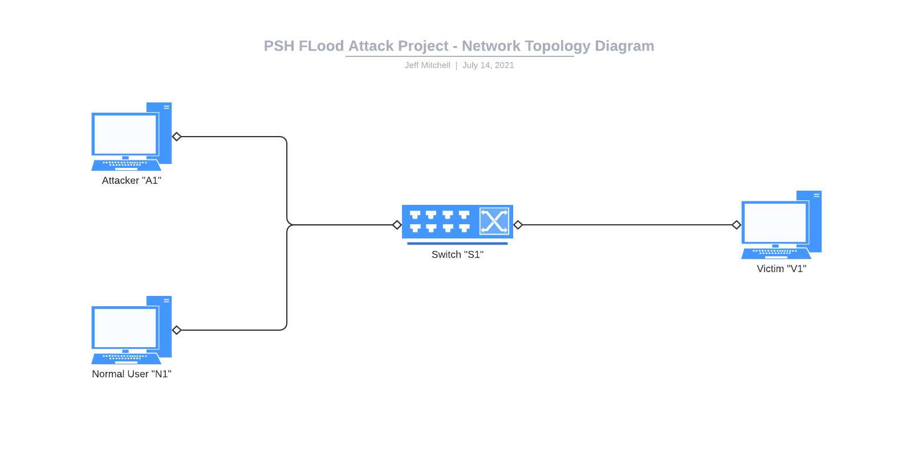

# CSC 7078 Secure Softwarized Networks
## The Detection And Protection Against TCP PSH Floods
## Jeff Mitchell 40203212

### How To Install

The Python application can be downloaded above from the "src" folder. The file will be called 40203212.py and should be downloaded and copied into your version of SDN-cockpit into the folder found at `sdn-cockpit\sync\local\apps\src`. Similarly, the scenario file can be found above in the scenarios folder and the file 40203212.yaml should be copied to `sdn-cockpit\sync\local\apps\scenarios` 

To begin using these files, SDN-cockpit must be up and running with XClient and XLaunch set up before starting SDN-cockpit to use XNodes for hosts for extra control of network traffic elements. Run the following commands after opening a git bash window inside the SDN-cockpit directory:

```
vagrant up
vagrant ssh -- -Y
bash run.sh
```

This will start up SDN-cockpit to its default state. You can begin by looking at the mininet pane of the tmux window, killing the currently running instance of mininet and running the following command to load up the network topology which we are using in this project:

```bash
sudo -E python3 remote/script_run_mininet.py /vagrant_data/local/apps/scenarios/40203212.yaml
```

This will create the virtual network as described by the topology diagram below and the IP and MAC addresses explained below. Moving over to the network controller pane of the tmux window, killing the currently running instance of that process  and running the bash command to fire up our Python network controller application:

```bash
python3 -m py_compile local/apps/src/40203212.py && ryu-manager --use-stderr --nouse-syslog --log-conf "" local/apps/src/40203212.py
```

#### Overview

This is a Python SDN application intended to be run through SDN-cockpit. The Python application uses the ryu manager to detect and protect a victim from a TCP and specifically a PSH flood attack. The topology of the virtual net consists of 3 hosts all connected to a switch. The hosts are:

1. A1 - This is our attacker and has the IP `11.0.0.1` and MAC 00:00:00:00:00:01
1. N1 - This is our normal traffic user and has IP `11.0.0.2` and MAC 00:00:00:00:00:02
1. V1 - This is our victim and has IP `22.0.0.1` and MAC 00:00:00:00:00:03

The setup of this project is to launch an attack from A1 to V1 and have the Python application running on the controller/switch detect the PSH flood attack and respond accordingly while having minimal disturbances to other users on the network. The application works by using parts of the learning switch to automatically allow traffic to flow in the network, to begin with. The application then works by extracting different pieces of data from the packets flowing through the network. From the Python file, we can see that the ethernet, IP and TCP protocols are extracted to get information, such as source and destination addresses (both MAC and IP) and In ports and Out ports to correctly forward traffic automatically.

### Network Topology



#### How The Code Works

A total count of all packets is used to calculate an instant network load to help with analysis. All of the above allows our controller to work naturally with all hosts on the network seamlessly. Now we can begin to narrow down the packet type that we are going to look at. Using the previously extracted TCP data from each packet, we can further refine the Python application to look for packets that meet the specific TCP_PSH flag.

The controller also keeps a running dictionary of all the IP addresses which have sent PSH packets through the network and includes a PSH packet count on a per MAC address basis. This is done using the following

```python
tcp_psh_packets_by_ip = dict()
```

The Python file contains a function called `detect_tcp_psh_packets()` which is called from the `packet_in handler` on every packet received but only executes when the `packet_in` is a TCP type packet that has the `TCP_PSH` flag set. This results in the function returning true and increasing the PSH packet count for the specific MAC address provided by arguments passed through the function.

This function is where all of the PSH packet analysis occurs. An attacker who floods the controller with PSH packets will quickly hit the limit set by the function. After some experimenting,l the limit has been set to around 2500 PSH packets and then the attacker will be issued a warning to stop flooding the network, followed by a 60-second traffic ban through the use of a flow rule which will drop all packets with a 60-second `hard_timeout` and `idle_timeout`.

A downside of this approach is that while a flood attacker will quickly reach the 2500 limit and be blocked, any normal traffic users on the network will slowly tick up to this limit over a longer period (approximately 42 minutes) and then the normal user's traffic will start getting blocked. This has been avoided by implementing an additional timing function that calculates the time between packets and calculated the speed of the flow of packets per second. There has been a limit of 50 packets per second set on the network, which is more than enough for normal traffic users but very quickly spikes and continues growing during a flood attack.

The timing function is accurate as sending packets through the network at 10 packets per second results in the function returning a value of 9.6 packets per second. When sending 100 packets per second, the function returns a value around 93. The function is accurate and scales well while easily detecting sudden spikes in network traffic and flood attacks.

While the traffic flow is below 50 packets per second, the `tcp_psh_packets_by_ip` is never incremented which removes the problem that would result in normal users being blocked after 42 minutes. Now, only when the packet flow is above 50 will the controller start to count packets in a pre-emptive attempt to detect a flood attack.

As normal, the flood attack easily increases the packet flow above 50 and then the 2500 packet limit is enforced, resulting in the attacker being quickly blocked without the possibility of normal users being blocked as they should not exceed the flow rate of 50 packets per second.

If this was not an attack and just heavy traffic flow for another reason, they will be allowed to start sending traffic again after 60 seconds and should make sure to limit their traffic flow as to not trigger the flood protection again.

If this was a real attack and the PSH flood starts again after the first temporary warning and ban, the attacker is given up to a total of 3 three temporary warnings and bans before a permanent block rule is placed on the attacker's MAC address, indefinitely blocking all traffic from this source until further review.

The temporary bans and warnings are put in place by calling the `launch_temp_countermeasures()` function and passing in the attacker's MAC address as an argument. This function contains the messages that are printed to screen and tracks the total number of warnings on each MAC address using a dictionary in a similar way that the total count of TCP PSH packets is tracked.

The permanent warning and ban are contained within another function call `launch_perma_countermneasures()` with a similar warning message and warning tracking system as the temporary countermeasures, but with the addition of the permanent block rule which has a higher priority and its hard_timeout and idle_timeout set to zero, which means that the rule will never timeout with the application running.

### Generating the traffic

The attack traffic and the normal traffic will be generated using the XNodes within mininet and using the hping3 command.

#### Normal traffic

The traffic which will be sent from the normal user N1 to the victim V1 is generated as follows

```
hping3 22.0.0.1 -p 80 -d 120
```

- `22.0.0.1` is the IPv4 address of where the traffic is being sent
- `-p 80` this tells hping3 to send the traffic specifically through port 80, this is not required but is representative of real TCP traffic
- `-d 120` this tells hping3 to set the size of the data field of the packet to 120 units as the default is 0

There is no need to specify to hping3 that we are using the TCP protocol as that is the default mode of hping3 anyway.

#### Flood traffic

The traffic which will be sent from the attacker A1 to the victim V1 is generated as follows

```
hping3 22.0.0.1 -p 80 -P --flood
```

- `22.0.0.1` is the IPv4 address of where the traffic is being sent
- `-p 80` this tells hping3 to send the traffic specifically through port 80, this is not required but is representative of real TCP traffic
- `-P` this tells hping3 to send TCP packets with the PSH flag bits as this is the type of attack we are trying to detect
- `--flood` this tells hping3 to send off the packets as quickly as possible

There is no need to specify to hping3 that we are using the TCP protocol as that is the default mode of hping3 anyway

### Testing

The application will be shown running live in the demonstration video. Some behind the scenes items that were tested included bringing up XTerm windows for the attacker A1 and the normal user N1 and then having Wireshark running on the victim V1. Wireshark was set up with a filter to only show TCP traffic from port 80 so that we could easily identify the traffic that we are interested in. This means that Wireshark will not show us other protocols such as ARP packets and ICMP packets. The normal traffic command above was then run inside the N1 XNode and we could see the traffic coming in through Wireshark. The flood traffic command above was then run inside the A1 XNode and after a few seconds, we can see the controller issues its first warning to the MAC address 00:00:00:00:00:02 which is the attacker's address (can be found by using the command `ifconfig` inside the XNode or can be found in the setup of the network topology in the project.yaml file) and temporary bans all traffic from this address for 60 seconds. We can see that the flood traffic command briefly pauses as no response is being received due to the temporary block rule.

Waiting and watching the command terminals, after 60 seconds we soon see PSH packets flooding in again after the block rule times out. Every packet that comes into the controller is logged and printed on the screen for debugging. The packet number and packet type are printed however, normally this information would not be printed. We can see that the attack starts up again from the A1 XNode terminal and the controller quickly issues a second warning and temporary ban. This cycle will repeat once more after 60 seconds and finally, a permanent block rule will be implemented. There is a small delay when a warning is generated and a flow rule sent out as the sheer amount of packets that hping3 can send does slow down the controller. This will allow some lingering packets to come into the controller but if there was no protection at all hping3 can easily send up to 50000 packets per second from initial testing. Setting the threshold at 2500 packets is still reasonable as when running the normal traffic command the which sends approximately 1 packet per second and even when `--fast` mode is used this is only a speed of 10 packets per second. This is 3 orders of magnitude less than the flood traffic and would take the normal user 42 minutes to meet this threshold which the attacker manages to do in about 2 seconds. However, a computational limit is quickly met when the controller is being flooded. The limit of the number of packets that can be processed is quickly met at approximately 960 packets per second whilst hping3 can send around 50000 packets per second. This is down to the limit of the power of the computer running the virtual machine and network. This result can be found in the evaluation below.

A test attack was launched with Wireshark running to record the traffic. Wireshark was set to filter and display only TCP traffic on port 80. Normal traffic was allowed to flow on the network and then the attack was launched waiting for the Python application to count and manage packets and set up block rules to prevent the attack from continuing on the network while Wireshark is recording the traffic. The .pcap file will be uploaded to accompany the graphs and descriptions of the attack. Below is a graph of the Wireshark capture which plots the packet flow of the normal network traffic and flood attack traffic against time.


The graph above can be summarised into 5 distinct stages. The first stage is the initial ~10 seconds of normal flow traffic followed by the ramping up of flood packets as the attack is launched around 10 seconds in. We can also see that the normal traffic flow is interrupted for the duration of the attack. At ~17 seconds, this is when the controller has counted enough packets and sets up the block rule for the MAC address of the attacker. With the block rule now in place, the flood traffic starts to decline as the lingering packets are being dropped and we can see from Wireshark that the victim V1 stops responding with RST-ACK packets as they are never received by the victim and are handled by the switch. Looking at our Python code we can see that the flood threshold is set at 25000 packets and looking at Wireshark 36145 PSH flood packets were sent with the victim receiving ~28457 packets before flow rules were created followed by ~7688 lingering packets being dropped by the controller. Normal traffic flow resumes after an interruption of 10.27 seconds caused by the flood attack.

### Evaluation

Investigating the seemingly low hard limit of 1000 packets per second is down to the number of resources the virtual machine is allowed to use from the host machine. When running SDN-cockpit for the first time the default resources that it was allowed to use from the host machine was 2GB of RAM and 2 processor cores, this is more than enough for the normal traffic on the network and it wasn't until we started testing the flood attack that we spotted the maximum packet flow was not even close to the number of packets per second it should have been. Below is a graph that shows the packet flow rate in packets per second for a normal traffic user (14-16 packets per second) on the blue line and the packet flow rate for an active flood attack (950-960 packets per second) on the network on the orange line sampled over 10 seconds after running for some time to stabilise. These results were recorded with the virtual machine using its default amount of resources.


The virtual machines resources were increased from 2GB of ram to 4GB and the processor core count was increased from 2 to 4. The test was run again, logging the normal traffic flow rate and the flood traffic flow rate and we can see that from below the maximum limit has now increased from 960 to approximately 1360 packets per second maximum, which is an increase of 400 packets per second or 42% improvement for doubling the resources of the controller.


