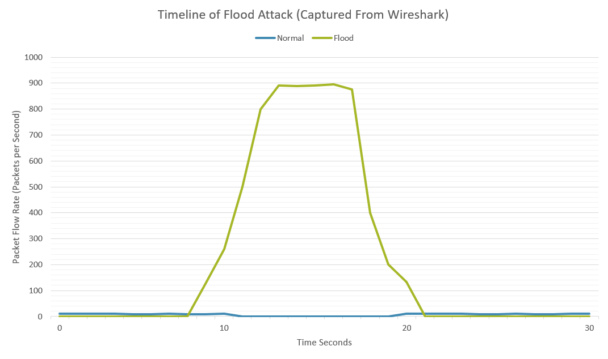
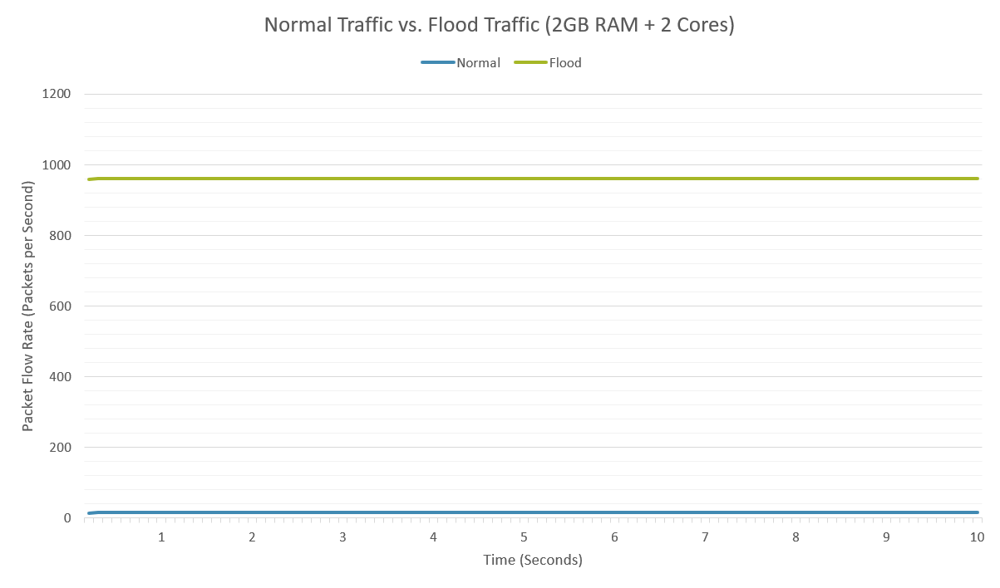
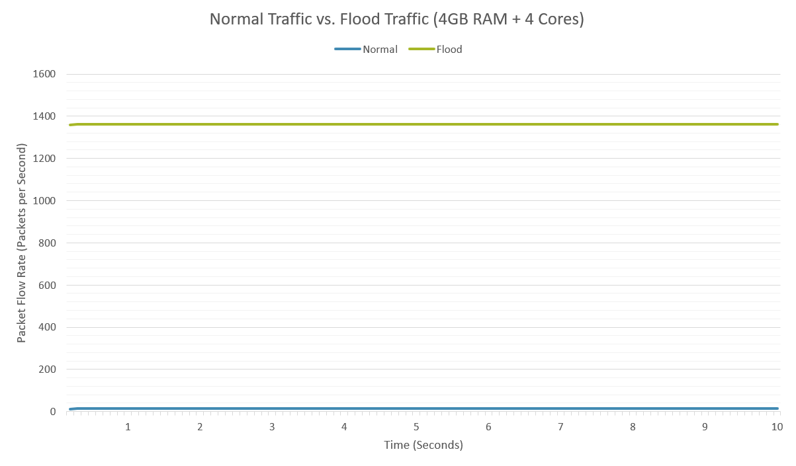
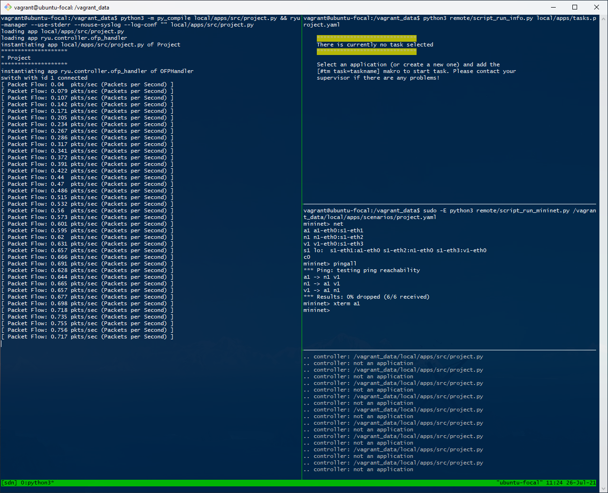
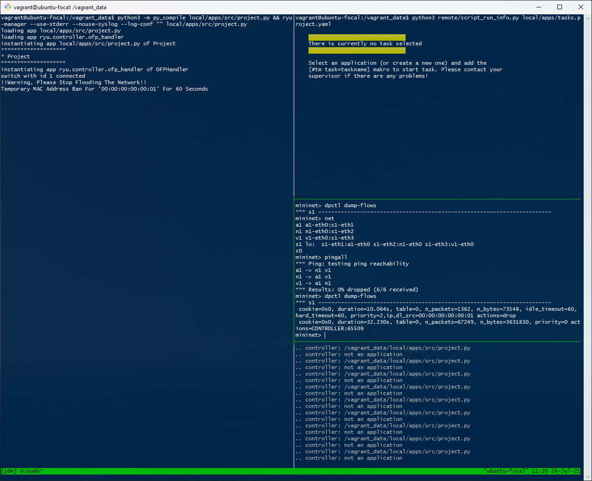
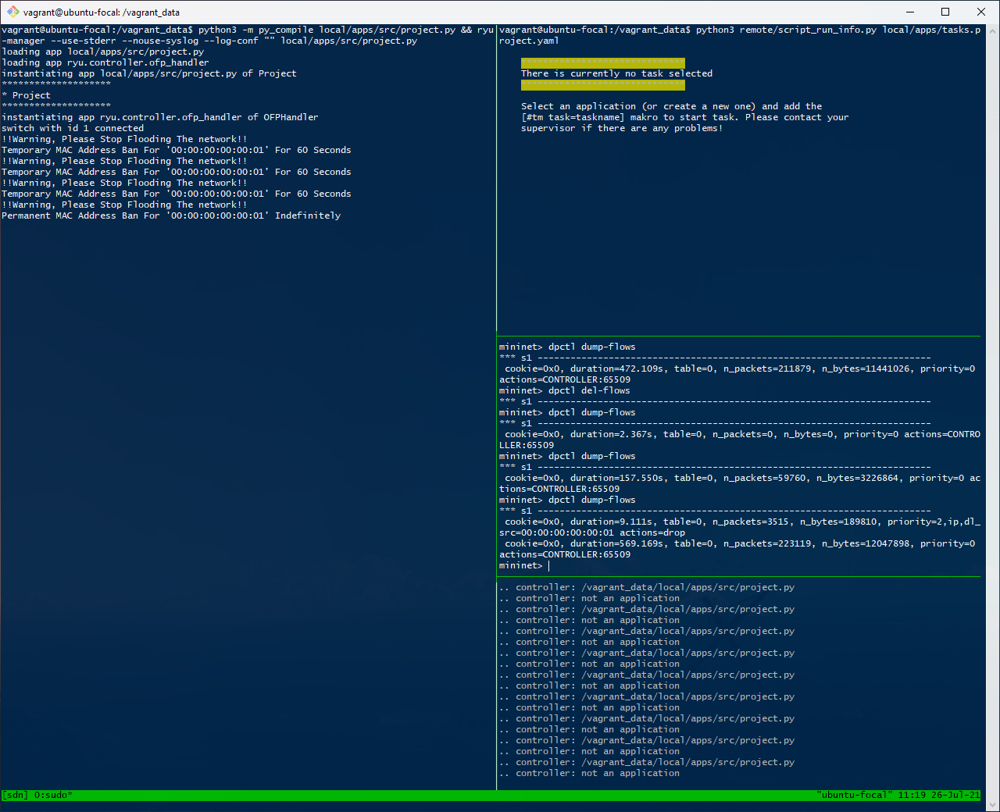

### Testing

The application will be shown running live in the demonstration video. Some behind the scenes items that were tested included bringing up XTerm windows for the attacker A1 and the normal user N1 and then having Wireshark running on the victim V1. Wireshark was set up with a filter to only show TCP traffic from port 80 so that we could easily identify the traffic that we are interested in. This means that Wireshark will not show us other protocols such as ARP packets and ICMP packets. The normal traffic command above was then run inside the N1 XNode, and we could see the traffic coming in through Wireshark. The flood traffic command above was then run inside the A1 XNode and after a few seconds, we can see the controller issues its first warning to the MAC address 00:00:00:00:00:02 which is the attacker's address (can be found by using the command `ifconfig` inside the XNode or can be found in the setup of the network topology in the project.yaml file) and temporary bans all traffic from this address for 60 seconds. We can see that the flood traffic command briefly pauses as no response is being received due to the temporary block rule.

Waiting and watching the command terminals, after 60 seconds we soon see PSH packets flooding in again after the block rule times out. Every packet that comes into the controller is logged and printed on the screen for debugging. The packet number and packet type are printed however, normally this information would not be printed. We can see that the attack starts up again from the A1 XNode terminal, and the controller quickly issues a second warning and temporary ban. This cycle will repeat once more after 60 seconds and finally, a permanent block rule will be implemented. There is a small delay when a warning is generated, and a flow rule is sent out as the sheer amount of packets that hping3 can send does slow down the controller. This will allow some lingering packets to come into the controller but if there was no protection at all hping3 can easily send up to 50000 packets per second from initial testing. Setting the threshold at 2500 packets is still reasonable as when running the normal traffic command the which sends approximately 1 packet per second and even when `--fast` mode is used this is only a speed of 10 packets per second. This is 3 orders of magnitude less than the flood traffic and would take the normal user 42 minutes to meet this threshold which the attacker manages to do in about 2 seconds. However, a computational limit is quickly met when the controller is being flooded. The limit of the number of packets that can be processed is quickly met at approximately 960 packets per second whilst hping3 can send around 50000 packets per second. This is down to the limit of the power of the computer running the virtual machine and network. This result can be found in the evaluation below.

A test attack was launched with Wireshark running to record the traffic. Wireshark was set to filter and display only TCP traffic on port 80. Normal traffic was allowed to flow on the network and then the attack was launched waiting for the Python application to count and manage packets and set up block rules to prevent the attack from continuing on the network while Wireshark is recording the traffic. The .pcap file will be uploaded to accompany the graphs and descriptions of the attack. Below is a graph of the Wireshark capture which plots the packet flow of the normal network traffic and flood attack traffic against time.

The graph above can be summarised into 5 distinct stages. The first stage is the initial ~10 seconds of normal flow traffic followed by the ramping up of flood packets as the attack is launched around 10 seconds in. We can also see that the normal traffic flow is interrupted for the duration of the attack. At ~17 seconds, this is when the controller has counted enough packets and sets up the block rule for the MAC address of the attacker. With the block rule now in place, the flood traffic starts to decline as the lingering packets are being dropped, and we can see from Wireshark that the victim V1 stops responding with RST-ACK packets as they are never received by the victim and are handled by the switch. Looking at our Python code we can see that the flood threshold is set at 25000 packets and looking at Wireshark 36145 PSH flood packets were sent with the victim receiving ~28457 packets before flow rules were created followed by ~7688 lingering packets being dropped by the controller. Normal traffic flow resumes after an interruption of 10.27 seconds caused by the flood attack.

### Evaluation

Investigating the seemingly low hard limit of 1000 packets per second is down to the number of resources the virtual machine is allowed to use from the host machine. When running SDN-cockpit for the first time the default resources that it was allowed to use from the host machine was 2 GB of RAM and 2 processor cores, this is more than enough for the normal traffic on the network, and it wasn't until we started testing the flood attack that we spotted the maximum packet flow was not even close to the number of packets per second it should have been. Below is a graph that shows the packet flow rate in packets per second for a normal traffic user (14-16 packets per second) on the blue line, and the packet flow rate for an active flood attack (950-960 packets per second) on the network on the orange line sampled over 10 seconds after running for some time to stabilise. These results were recorded with the virtual machine using its default amount of resources.

The virtual machines resources were increased from 2 GB of ram to 4 GB, and the processor core count was increased from 2 to 4. The test was run again, logging the normal traffic flow rate, and the flood traffic flow rate, and we can see that from below the maximum limit has now increased from 960 to approximately 1360 packets per second maximum, which is an increase of 400 packets per second or 42% improvement for doubling the resources of the controller.

Some screenshots showing specific features of the Python application in action such as when the packet flow logs are enabled which can be seen below followed by other screenshots where this log is turned off so that other messages can be seen such as the flood warning messages and temporary and permanent ban functions being called.

When the packet flow rate logging is turned on as seen above it can be easy to miss other messages as even with normal traffic flowing through the network the console log updates and scrolls too fast to be able to see any other messages as even packet is printed to screen. It was designed only to be a debugging tool to ensure that the countermeasures are only being activated when the packet flow rate is above 50 packets per second.

The next two screenshots show the flood warning messages and ban notifications. It also displays flow rules in the mininet pane showing the drop packet actions for the temporary flow rules with the 60-second idle_timeout and 60-second hard_timeout. For the permanent flow rule showing the drop packets rule with no timeout and both rules showing the offending MAC addresses.

